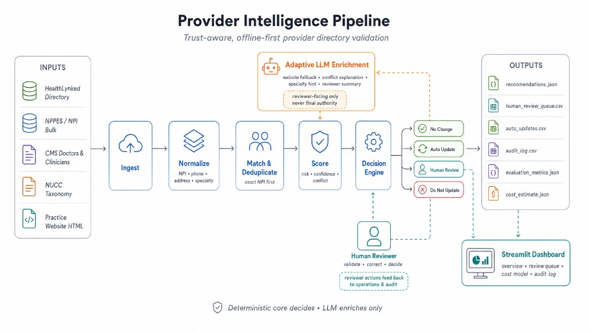
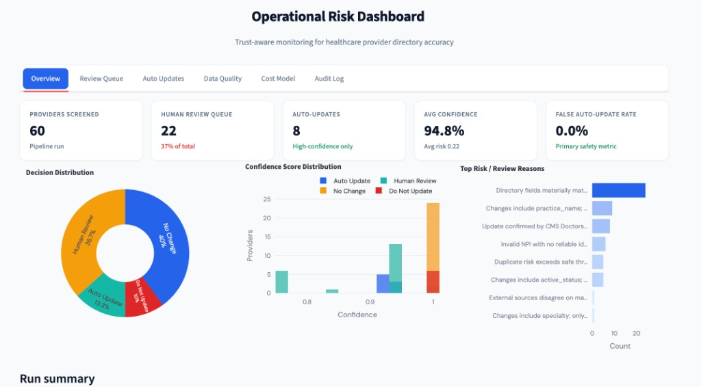
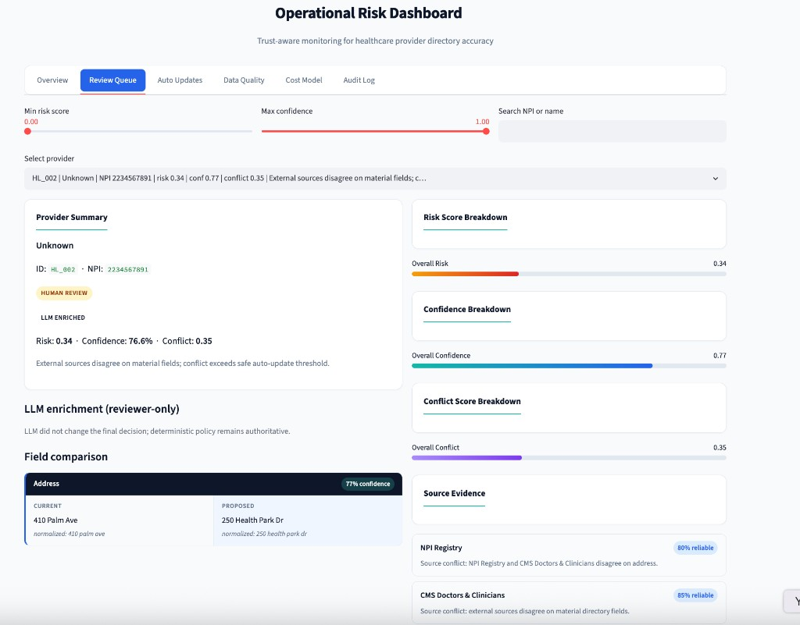

# Provider Intelligence Pipeline

Trust-aware, **offline-first** healthcare provider directory validation — deterministic scoring, bounded LLM enrichment, human review, and full audit trail.

Built for the **HealthLynked / Kaggle** provider directory update challenge.


---

## What it does

1. Compares internal provider records against **NPPES**, **CMS**, **NUCC**, and practice HTML snapshots  
2. Normalizes phones, addresses, and specialties  
3. Scores **risk**, **confidence**, and **conflict** with expert-initialized YAML weights  
4. Routes to `auto_update` · `human_review` · `no_change` · `do_not_update`  
5. Writes recommendations, queues, metrics, cost estimates, and audit logs  
6. Powers a **Streamlit** operational dashboard for reviewers  

**Safety first:** primary metric is `false_auto_update_rate` on a synthetic benchmark. LLM **enriches only** — it never approves auto-updates.

---

## Architecture

Offline-first pipeline with a deterministic decision core. LLM assists ambiguous cases but never overrides thresholds.



> **Deterministic core decides · LLM enriches only**

---

## Dashboard

Operational Streamlit UI for reviewers — overview metrics, conflict triage, auto-update audit, cost model, and full event log.

### Overview



### Review Queue (HL_002 — conflict routing)

Human review when external sources disagree. LLM enrichment is visible but does not change the final action.



---

## Demo snapshot

| Metric | Typical run |
|--------|-------------|
| Records | 60 |
| Auto-updates | 8 |
| Human review | 22 |
| False auto-update rate | **0.0%** |
| Cost / 1k records | **~$211** vs **$500** manual baseline |
| LLM share (with keys) | **5–7%** (cap 8%) |

Showcase: **HL_001** safe auto-update · **HL_002** conflict → human review.

---

## Quick start

```bash
git clone https://github.com/delliriumL/Provider-Intelligence-Pipeline.git
cd Provider-Intelligence-Pipeline
python3 -m venv .venv && source .venv/bin/activate
pip install -r requirements.txt

make demo    # data → pipeline → evaluate → cost
make app     # http://localhost:8501
make test    # offline-safe pytest
```

With API credentials (optional, local `.env` only):

```bash
cp .env.example .env
LLM_MODE=auto make demo
```

---

## Repository layout

```
config/               thresholds, weights, LLM policy (YAML)
data/sample/          demo CSV inputs
data/raw/             practice website HTML snapshots
docs/PROJECT.md       complete project documentation
docs/screenshots/     README visuals (architecture + dashboard)
docs/sample_outputs/  dashboard fallback samples
src/                  pipeline package
app/                  Streamlit dashboard
tests/                pytest suite
outputs/              runtime artifacts (gitignored)
```

---

## Documentation

**Everything in one place:** [docs/PROJECT.md](docs/PROJECT.md)

Scoring · LLM policy · cost model · data sources · demo walkthrough · CLI · roadmap.

---

## Key commands

```bash
make demo              # full offline workflow
make demo-llm          # LLM_MODE=auto
make demo-compare      # rule-only vs adaptive LLM
make test && make lint
streamlit run app/streamlit_app.py
```

---

## Security

Do **not** commit `.env` or API keys. See `.env.example` for local configuration.

---

## License

MIT — see [LICENSE](LICENSE).
